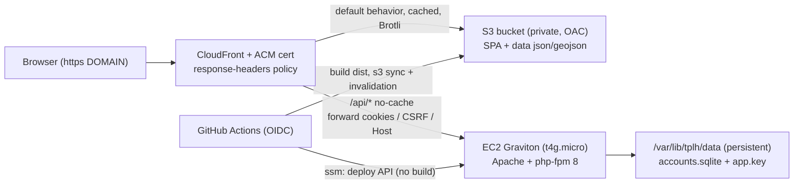

# Deploying Texas Public Land Hunting to AWS (Tier 3)

This directory contains a complete, automated plan for hosting the site on AWS,
plus a GitHub Actions pipeline that redeploys on every push to `main`.

**This build implements Tier 3**: the static site (SPA + map data) is served from
a private **S3 bucket behind CloudFront**, and only `/api/*` (the PHP + SQLite
accounts API) runs on a small **Graviton EC2** instance. The frontend is **built
in CI**, not on the box. See [SCALING-TIERS.md](SCALING-TIERS.md) for the full
tier analysis (cost / performance / scalability) and **Tier 4** (serverless API)
recorded for future consideration.

---

## 1. Architecture



Key decisions:

- **Static on S3 + CloudFront.** The app is ~95% static and identical for every
  user, so it caches at the edge (near-unbounded read concurrency, global latency
  reduction, edge Brotli). The origin is barely touched.
- **API on one small Graviton box.** `/api/*` needs PHP + single-writer SQLite,
  so it stays on a `t4g.micro` running Apache + php-fpm. The app's `api/.htaccess`
  runs unchanged (`AllowOverride All`).
- **Build in CI.** GitHub Actions runs `npm run build`, so the instance needs no
  Node and can stay small.
- **Persistent data outside releases** at `/var/lib/tplh/data`, passed to PHP via
  the php-fpm pool `env[AUTH_DATA_DIR]`. Redeploys never touch accounts.
- **Private repo → read-only deploy key** for the instance to pull the API code.
- **No long-lived AWS keys / no inbound SSH for CI**: GitHub OIDC assumes an IAM
  role scoped to this project's S3 bucket, CloudFront distribution, and instance.
- **Two TLS certs**: a public **ACM** cert on CloudFront (for `DOMAIN`), and a
  small **Let's Encrypt** cert on the instance for the CloudFront→origin hop
  (`API_ORIGIN_DOMAIN`). No ALB (that would cost more than the instance).

> The CARTO basemap key is compiled into the frontend source, so there is no
> build-time secret to configure.

---

## 2. Cost (us-east-1, approximate)

| Item | Monthly |
| --- | --- |
| EC2 `t4g.micro` on-demand (730 h) | ~$6 |
| 10 GiB gp3 EBS | ~$0.80 |
| S3 storage (~5 MB) + requests | ~$0.05 |
| CloudFront | Free tier covers typical hunt-planner traffic; pennies beyond |
| ACM certificate | $0 |
| Elastic IP (while associated) | $0 |
| **Total** | **~$7–9** |

A 1-year Savings Plan on the `t4g.micro` drops compute further. Compare with the
single-box baseline (~$18–20/mo) in [SCALING-TIERS.md](SCALING-TIERS.md).

---

## 3. Prerequisites (on your workstation)

- AWS account + **AWS CLI v2** configured (`aws configure`); `aws sts get-caller-identity` works.
- `jq` (used by the scripts).
- `git`, `ssh`, `scp`.
- Optional: GitHub CLI `gh` (authenticated) so `make-deploy-key.sh` can register
  the deploy key automatically.
- DNS you control for `DOMAIN` (apex needs ALIAS/ANAME support, e.g. Route 53).

---

## 4. Files

| File | Runs where | Purpose |
| --- | --- | --- |
| `config.example.sh` | — | Copy to `config.sh`, edit; auto-sourced. |
| `lib.sh` | workstation | Shared logging/AWS helpers. |
| `provision.sh` | workstation | Key pair, security group, SSM role, Graviton EC2 (API origin), Elastic IP. |
| `bootstrap.sh` | instance (user-data) | Install Apache/php-fpm (no Node), vhost + pool env, dirs. |
| `make-deploy-key.sh` | workstation | Create + install the read-only GitHub deploy key. |
| `deploy.sh` | instance | Pull repo → publish PHP `api/` → reload → health check (no build). |
| `setup-tls.sh` | instance | Let's Encrypt cert for `API_ORIGIN_DOMAIN` + renew. |
| `provision-cdn.sh` | workstation | S3 bucket (OAC), ACM cert, CloudFront (2 behaviors), response-headers policy. |
| `setup-github-oidc.sh` | workstation | OIDC provider + IAM role scoped to S3/CloudFront/SSM. |
| `teardown.sh` | workstation | Delete everything this tooling created (incl. CloudFront/S3). |
| `apache/tplh.conf` | reference | Reviewable copy of the origin vhost. |
| `SCALING-TIERS.md` | docs | Tier analysis + Tier 4 (future). |
| `../../.github/workflows/deploy-aws.yml` | GitHub | CI/CD: static→S3+CloudFront, API→SSM. |

---

## 5. Step-by-step

### 5.0 Configure

```bash
cd deploy/aws
cp config.example.sh config.sh
# Edit config.sh: SSH_ALLOW_CIDR (your IP/32), DOMAIN, DOMAIN_ALIASES,
# API_ORIGIN_DOMAIN, ADMIN_EMAIL, and a globally-unique S3_BUCKET.
# Optionally set HOSTED_ZONE_ID to automate DNS (ACM validation + aliases).
```

`config.sh`, `*.pem`, and `deploy-key*` are git-ignored.

### 5.1 Provision the API instance

```bash
./provision.sh
```

Creates the key pair, security group (80/443 open for CloudFront + ACME, 22 from
your CIDR), SSM role, the Graviton EC2 instance (bootstrapped API-only), and an
Elastic IP. Prints the public IP and writes `.outputs.env`.

### 5.2 Point the API origin DNS at the box

Create `API_ORIGIN_DOMAIN` → the Elastic IP (A record). This is required before
the instance can get its Let's Encrypt origin cert.

### 5.3 Install the deploy key (private repo access)

```bash
./make-deploy-key.sh
```

### 5.4 Publish the API

```bash
ssh -i tplh-admin.pem ec2-user@<PUBLIC_IP> 'sudo bash /opt/tplh/deploy.sh'
```

### 5.5 Issue the origin TLS cert (after origin DNS resolves)

```bash
ssh -i tplh-admin.pem ec2-user@<PUBLIC_IP> 'sudo bash /opt/tplh/setup-tls.sh'
```

### 5.6 Create the S3 + CloudFront front

```bash
./provision-cdn.sh
```

Creates the private bucket (OAC), the response-headers policy, the public ACM
certificate (DNS-validated — automated if `HOSTED_ZONE_ID` is set, otherwise it
prints the validation records and you re-run after adding them), and the
CloudFront distribution with two behaviors (`/*`→S3 cached, `/api/*`→the instance
uncached). Prints the CloudFront domain.

### 5.7 Point public DNS at CloudFront

Create `DOMAIN` (and `www`) → the CloudFront domain. Apex records need an
ALIAS/ANAME (Route 53 alias, or a provider that flattens CNAMEs). This is
automated when `HOSTED_ZONE_ID` is set.

### 5.8 Continuous deployment

```bash
./setup-github-oidc.sh
```

Creates the OIDC provider and a deploy role scoped to this bucket, distribution,
and instance. Add the printed **repository secrets**:

- `AWS_DEPLOY_ROLE_ARN`, `AWS_REGION`, `TPLH_INSTANCE_ID`, `S3_BUCKET`, `CLOUDFRONT_DISTRIBUTION_ID`

Every push to `main` then runs [.github/workflows/deploy-aws.yml](../../.github/workflows/deploy-aws.yml):
the `static` job builds `dist`, `aws s3 sync`s it (excluding `api/`), and
invalidates CloudFront; the `api` job triggers `deploy.sh` on the instance via SSM.

---

## 6. Operations

- **Redeploy:** push to `main`, run the workflow, or run the jobs' steps manually.
- **Roll back the API:** releases are under `/var/www/tplh/releases/`; point
  `current` at a previous one and `systemctl reload httpd`.
- **Roll back static:** re-sync a previous `dist` build to S3 and invalidate.
- **Logs:** `/var/log/httpd/tplh_error.log`, `/var/log/tplh-bootstrap.log`;
  CloudFront/S3 access logs if enabled.
- **Back up accounts:** `sqlite3 /var/lib/tplh/data/accounts.sqlite ".backup '/tmp/accounts.sqlite'"`
  and copy off-box (keep `app.key` with it).
- **Admins:** `AUTH_ADMIN_EMAILS` (php-fpm env) or `/var/lib/tplh/data/admins.txt`.

---

## 7. Security notes

- Lock `SSH_ALLOW_CIDR` to your IP (or drop 22 and use `aws ssm start-session`).
  Optionally restrict the instance SG 80/443 to CloudFront's managed prefix list
  (`com.amazonaws.global.cloudfront.origin-facing`).
- IMDSv2 required (`HttpTokens=required`). Deploy key is read-only. CI holds no
  AWS secrets (OIDC) and the role is scoped to this bucket/distribution/instance.
- S3 is private (Block Public Access on) and only readable by this distribution
  via OAC. `api/data` is never served (outside docroot + `.htaccess`).
- Never commit `config.sh`, `*.pem`, or `deploy-key*` (all git-ignored).

---

## 8. Teardown

```bash
./teardown.sh           # prompts; FORCE=1 to skip, FORCE_ALL=1 to also drop the CI role
```

Terminates the instance; releases the EIP; deletes the security group, instance
profile/role, and key pair; disables + deletes the CloudFront distribution (slow),
the OAC, the response-headers policy, the S3 bucket, and the ACM cert. The OIDC
provider is left in place (it may be shared).

---

## 9. Troubleshooting

- **`provision-cdn.sh` stops at ACM validation:** add the printed CNAME(s) at your
  DNS provider, then re-run (or set `HOSTED_ZONE_ID` to automate).
- **CloudFront 502/504 on `/api`:** the origin cert isn't issued yet or
  `API_ORIGIN_DOMAIN` doesn't resolve to the box — finish 5.2 and 5.5.
- **Sign-in fails behind CloudFront:** the `/api/*` behavior must forward cookies,
  the `X-CSRF-Token` header, and `Host` (the `AllViewer` origin request policy
  used by `provision-cdn.sh` does this).
- **Static 403 from S3:** the bucket policy / OAC wasn't applied — re-run
  `provision-cdn.sh` (it sets the policy after the distribution exists).
- **API deploy can't clone:** re-run `make-deploy-key.sh`.
