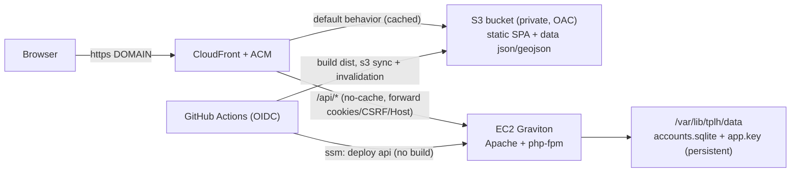
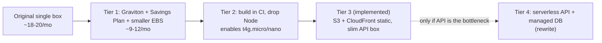

# AWS deployment tiers (efficiency & cost)

This document records the optimization tiers considered for hosting Texas Public
Land Hunting on AWS, their cost/performance/scalability trade-offs, and which one
this repo implements.

**This build implements Tier 3** (S3 + CloudFront for the static site, a slim
Graviton EC2 box for the PHP/SQLite API, built in CI). **Tier 4 is recorded for
future consideration** if the API itself ever becomes the measured bottleneck.

## Where the cost and load actually are

Measured from a production build of `web/dist`:

| Item | Size |
| --- | --- |
| Total `dist` | ~4.4 MB |
| JS bundle | 1.29 MB (364 KB gzipped) |
| Map data (`data/*.json`, `*.geojson`) | ~2.7 MB raw / ~347 KB gzipped |
| Heaviest single file | `data/counties.json` 770 KB |

A cold visit transfers ~0.8–1.2 MB. At EC2 egress (~$0.09/GB) that is ~$0.09 per
~1,000 visits, so **egress is negligible**. The dominant cost is the **always-on
instance**, and the main inefficiency in the original single-box design was
**building on the instance** (forcing Node + a larger box than the runtime needs).

The app is ~95% static (SPA + read-only JSON/GeoJSON that is identical for every
user). Only `/api/*` (sign-in, favorites) needs PHP + single-writer SQLite.

## The tiers

### Tier 1 — Low-effort cost wins (single box)

- Graviton `t4g.small` instead of `t3.small` (~20% cheaper, better price/perf).
- 1-year Compute Savings Plan / Reserved Instance (~30–40% off compute).
- Smaller `gp3` root volume (8–10 GB).
- Optionally Lightsail ($5–7/mo fixed) instead of EC2 + EBS + EIP.

Architecture unchanged (one box serves static + API). Scaling is **vertical
only**. ~$18–20/mo → ~$9–12/mo.

### Tier 2 — Build in CI (decouple build from runtime)

Move `npm run build` into GitHub Actions and ship the prebuilt `dist`. The
instance drops Node and only runs Apache + php-fpm, so it can shrink to
`t4g.micro`/`t4g.nano`. Faster, deterministic deploys; smaller attack surface.
Enabler for the biggest downsizing.

### Tier 3 — S3 + CloudFront static, slim API box (IMPLEMENTED)

Serve `dist` from a private S3 bucket behind CloudFront; route only `/api/*` to
the EC2 instance.

- Static + data cached at the edge → near-unbounded concurrency, global latency
  reduction, edge Brotli. Origin is hit roughly once per edge PoP per version.
- Security headers move to a CloudFront response-headers policy (ported from
  [web/public/.htaccess](../../web/public/.htaccess)).
- `/api/*` is an uncacheable behavior (the API sends `Cache-Control: no-store`)
  that forwards cookies, the `X-CSRF-Token` header, the `Host` header, and all
  methods to the instance.
- The instance is Graviton, API-only, and can be `t4g.micro`/`nano`.

Most scalable of the designed tiers. See the data flow below.

**Scaling ceiling:** static scales at the edge essentially without limit; the one
true bottleneck is the stateful API — PHP on a single instance over
single-writer SQLite ([web/public/api/lib/store.php](../../web/public/api/lib/store.php)),
with CPU-heavy Argon2id per login. For this app that ceiling is very high because
auth/favorites are infrequent relative to map/data views.

### Tier 4 — Serverless / horizontally-scalable API (future consideration)

Only needed if the SQLite-backed API — not static delivery — becomes the measured
bottleneck. This removes the single-writer and single-instance limits but is a
**rewrite, not a hosting change**:

- Replace `php -S` / Apache+php-fpm with **Lambda + API Gateway** (or Fargate
  containers behind the same CloudFront `/api/*` behavior).
- Replace **SQLite** with **DynamoDB** or **Aurora Serverless v2**, which means
  rewriting [web/public/api/lib/store.php](../../web/public/api/lib/store.php)
  (users, sessions, favorites, rate limits) and moving sessions off local disk.
- Keep CloudFront + S3 for static exactly as in Tier 3.

Trade-offs to weigh before adopting Tier 4:

- Argon2id is intentionally CPU-heavy (19 MiB, t=3); on Lambda this means larger
  memory sizing and cold-start latency on login.
- DynamoDB requires modeling the current relational access patterns
  (unique username/email, session lookup by token hash, favorites per user,
  rate-limit windows); Aurora Serverless v2 keeps SQL but has a minimum ACU cost
  and is not true scale-to-zero.
- More infrastructure (function, API Gateway/ALB, IAM, a managed DB) and a data
  migration from the existing `accounts.sqlite`.

Recommendation: stay on Tier 3 until API latency or throughput is a demonstrated
problem; adopt Tier 4 per-concern (first the DB, then the compute) rather than all
at once.

## Recommended path

Avoid adding an ALB (~$16/mo, more than the instance). Let CloudFront terminate
public TLS (ACM) and keep a lightweight Let's Encrypt cert on the instance only
for the CloudFront→origin hop.
