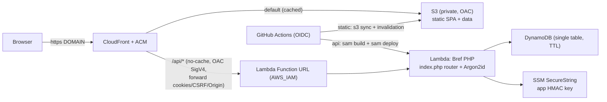

# Tier 4 - Serverless accounts API (PHP/Bref on Lambda + DynamoDB)

This directory deploys the **Tier 4** architecture from [../SCALING-TIERS.md](../SCALING-TIERS.md):
a serverless, scale-to-zero accounts API. The static site keeps using the **Tier 3**
S3 + CloudFront stack unchanged; Tier 4 only replaces the stateful `/api/*` backend
(Apache/php-fpm + SQLite on EC2) with:

- **AWS Lambda** running the existing PHP router via the **Bref** FPM runtime,
- a **Lambda Function URL** (IAM-authenticated) that CloudFront routes `/api/*` to,
- **DynamoDB** (on-demand, single table) for users / sessions / favorites / rate limits,
- the app HMAC key in **SSM Parameter Store** (SecureString).

No EC2, no Apache, no ALB, no API Gateway. The same CloudFront distribution and S3
bucket from Tier 3 are reused; only the `/api/*` origin is swapped.

## Architecture



Requests enter CloudFront, which signs `/api/*` requests with SigV4 via an Origin
Access Control (OAC) of type `lambda`, so the Function URL stays private (it rejects
anything not signed by this distribution). Because OAC signs the `Host` header, the
`/api/*` behavior uses the managed **AllViewerExceptHostHeader** origin-request policy
(cookies, `X-CSRF-Token`, `Origin`, and `Referer` are still forwarded).

## Why it preserves the existing behavior

- `src/index.php`, `src/lib/validate.php`, and the router logic are the **same** as the
  EC2 build. Only the data layer and request-context helpers changed.
- `src/lib/store.php` is rewritten against DynamoDB (single-table design below) but keeps
  every `tplh_*` function signature, so the router is reused verbatim.
- `src/lib/password.php` hashes with **Argon2id via libsodium** (`sodium_crypto_pwhash_str`),
  which Bref ships. libsodium and PHP's `password_hash()` both emit the standard
  `$argon2id$v=19$m=19456,t=3,p=1$...` string, so hashes created on Tier 3 verify here
  unchanged (and migrated users can sign in with their existing passwords).
- `src/lib/http.php` matches the viewer `Origin`/`Referer` against an **allowlist**
  (`AUTH_ALLOWED_ORIGINS`) instead of `Host` (OAC overwrites `Host`), and derives the
  client IP from `X-Forwarded-For` / `CloudFront-Viewer-Address`.

## DynamoDB single-table design

One table (default `tplh_accounts`), composite key `PK` + `SK`, TTL attribute `ttl`:

| Entity | PK | SK | Notes |
| --- | --- | --- | --- |
| User profile | `USER#<id>` | `PROFILE` | username, email, password_hash, role, timestamps |
| Username reservation | `USERNAME#<lower>` | `UNAME` | uniqueness via `attribute_not_exists` |
| Email reservation | `EMAIL#<lower>` | `EMAIL` | uniqueness via `attribute_not_exists` |
| Session | `SESSION#<token_hash>` | `SESSION` | user_id, csrf_hash, expires_at, `ttl` |
| Favorite | `USER#<id>` | `FAV#<unit_id>` | listed via `begins_with(SK, 'FAV#')` |
| Rate limit | `RL#<key>` | `RL` | fixed window + lock, auto-expiring `ttl` |

Account creation and username changes use `TransactWriteItems` so the uniqueness
reservations and the profile stay consistent.

## Cost (us-east-1, on-demand)

Dominated by fixed costs at low/medium traffic; scales to zero when idle.

| Traffic | Lambda | DynamoDB | CloudFront/S3 | Route 53 | Total |
| --- | --- | --- | --- | --- | --- |
| ~10k visits/mo | ~$0 (free tier) | ~$0.02 | ~$0 (free tier) | $0.50 | **~$0.50-1/mo** |
| ~100k visits/mo | ~$0 (free tier) | ~$0.12 | ~$0 (free tier) | $0.50 | **~$1-2/mo** |
| ~1M visits/mo | ~$0.02 | ~$1.20 | ~$0-2 | $0.50 | **~$5-8/mo** |

Lambda's perpetual free tier (1M requests + 400k GB-s/mo) and CloudFront's (1 TB +
10M requests/mo) cover this niche app's API load. Avoid provisioned concurrency
(it reintroduces an always-on charge); Bref cold starts are a latency, not cost, concern.

## Files

| File | Purpose |
| --- | --- |
| `template.yaml` | SAM: Lambda + Function URL (AWS_IAM) + DynamoDB + log group + IAM |
| `samconfig.toml` | Default `sam deploy` parameters (edit the Bref layer + origins) |
| `Makefile` | `sam build` hook: copies `src/` + runs `composer install --no-dev` |
| `composer.json` | `bref/bref` + `aws/aws-sdk-php` |
| `src/index.php` | Bref front controller (shared router) |
| `src/lib/store.php` | DynamoDB data layer |
| `src/lib/password.php` | Argon2id via libsodium |
| `src/lib/http.php` | origin allowlist + forwarded client IP + JSON helpers |
| `create-app-key.sh` | one-time: write the app HMAC key to SSM SecureString |
| `connect-cloudfront.sh` | point the Tier 3 `/api/*` behavior at the Function URL (OAC) |
| `migrate-sqlite-to-dynamo.php` | copy users + favorites from `accounts.sqlite` |
| `setup-github-oidc-tier4.sh` | OIDC deploy role for CI |
| `teardown-tier4.sh` | delete the SAM stack + OAC (optionally the app key) |
| `config.example.sh` | copy to `config.sh` (git-ignored) and edit |

## Prerequisites

- An existing **Tier 3** static front (run `../provision-cdn.sh` first): a private
  S3 bucket + CloudFront distribution whose `/api/*` behavior targets an `api-origin`.
- Local tools: AWS CLI v2 (configured), **AWS SAM CLI**, Docker (for `sam build`), PHP 8.1+
  with `composer`, and `jq`.
- The current **Bref FPM layer ARN** for your region + architecture from
  <https://runtimes.bref.sh> (AWS account `534081306603`), e.g.
  `arn:aws:lambda:us-east-1:534081306603:layer:arm-php-83-fpm:<version>`.

## Step-by-step deployment

1. **Configure.** `cp config.example.sh config.sh` and set `AWS_REGION`, `S3_BUCKET`,
   `CLOUDFRONT_DISTRIBUTION_ID` (from `../.outputs.env`), `DOMAIN`, `ALLOWED_ORIGINS`,
   and `ADMIN_EMAILS`. Put the Bref layer ARN into `samconfig.toml` (and, for CI, the
   `BREF_FPM_LAYER_ARN` secret).

2. **Create the app key (once).**
   ```bash
   ./create-app-key.sh
   ```
   Writes an `SSM SecureString` at `APP_KEY_SSM_PARAM` (default `/tplh/tier4/app_key`).

3. **Install dependencies.**
   ```bash
   composer install
   ```

4. **Build + deploy the API.**
   ```bash
   sam build
   sam deploy --guided      # first time; afterwards just `sam deploy`
   ```
   Creates the DynamoDB table, the Lambda, its Function URL, the log group, and the
   execution role. Note the `ApiFunctionUrl` output.

5. **Migrate existing accounts (optional).** Against a *copy* of the live DB:
   ```bash
   AWS_REGION=us-east-1 AUTH_TABLE=tplh_accounts \
     php migrate-sqlite-to-dynamo.php /path/to/accounts.sqlite
   ```

6. **Point CloudFront at the Function URL.**
   ```bash
   ./connect-cloudfront.sh
   ```
   Creates the lambda OAC, rewrites the `/api/*` origin to the Function URL domain,
   switches the origin-request policy to AllViewerExceptHostHeader, grants CloudFront
   `lambda:InvokeFunctionUrl`, and invalidates `/api/*`.

7. **Public DNS** is unchanged - it already points at the Tier 3 CloudFront alias.

8. **CI (optional).**
   ```bash
   ./setup-github-oidc-tier4.sh
   ```
   Creates the OIDC deploy role and prints the repo secrets to set
   (`AWS_DEPLOY_ROLE_ARN`, `AWS_REGION`, `S3_BUCKET`, `CLOUDFRONT_DISTRIBUTION_ID`,
   `BREF_FPM_LAYER_ARN`, `ALLOWED_ORIGINS`, `ADMIN_EMAILS`). Then run
   `.github/workflows/deploy-aws-tier4.yml` (manual-dispatch by default).

9. **Verify.**
   ```bash
   curl -sS https://$DOMAIN/api/health            # {"ok":true,"hasher":"argon2id"}
   # sign up / sign in from the site; confirm the tplh_sid cookie + favorites persist
   aws dynamodb scan --table-name tplh_accounts --max-items 5
   curl -i https://<function-url-domain>/api/health   # should be 403 (OAC-only)
   ```

## Operations

- **Logs**: CloudWatch `/aws/lambda/<stack>-api` (14-day retention).
- **Rotate the app key**: `./create-app-key.sh --force` (invalidates existing sessions).
- **Admins**: set `ADMIN_EMAILS` (stack parameter / `AUTH_ADMIN_EMAILS` env); role is
  synced on the user's next authenticated request.

## Security notes

- The Function URL is `AuthType: AWS_IAM`; only this CloudFront distribution (via OAC)
  can invoke it. Direct hits to the Function URL return 403.
- Session + CSRF tokens are stored **hashed** (HMAC-SHA256 with the SSM app key).
- DynamoDB is encrypted at rest (SSE) with point-in-time recovery enabled.
- Cookies are `HttpOnly`, `SameSite=Lax`, and `Secure` in production
  (`AUTH_FORCE_SECURE_COOKIE=1`).

### Fallback: shared-secret header instead of OAC

If CloudFront OAC body-signing for Lambda Function URLs is problematic in your account,
switch the Function URL to `AuthType: NONE` and instead have CloudFront add a secret
custom origin header (e.g. `X-Origin-Verify: <random>`) on the `/api/*` origin, and
reject requests in `index.php` that lack it. OAC (the default here) is preferred.

## Teardown

```bash
./teardown-tier4.sh            # delete the stack + OAC
./teardown-tier4.sh --purge-key --yes   # also delete the SSM app key, no prompt
```

This leaves the Tier 3 S3 bucket and CloudFront distribution intact. To restore the
EC2 API afterwards, re-run `../provision-cdn.sh`.
