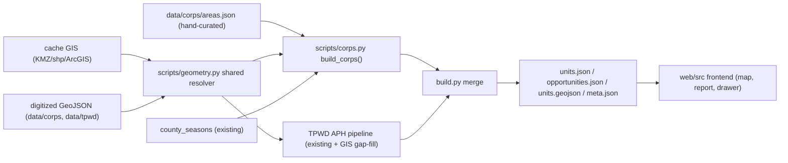

---
todos:
  - id: research
    status: completed
    content: 'Enumerate all Texas USACE hunting lakes and compile per-area details (species, means, permit process/cost, official links, hunt-map PDF, county, region, coordinates, GIS availability) into data/corps/areas.json + data/corps/SOURCES.md'
  - id: corps-module
    status: completed
    content: Add scripts/corps.py (build_corps) generating Corps units/opportunities/features; reuse county season windows
  - id: build-merge
    status: completed
    content: Integrate Corps output into scripts/build.py (merge units/opportunities/features) and extend meta.access + meta.sources
  - id: geometry-shared
    status: completed
    content: 'Shared geometry: extend scripts/geometry.py with shapefile/ArcGIS reader + reproject/simplify; add --corps-gis/--tpwd-gis fetch paths to scripts/fetch.py (cache/, gitignored)'
  - id: geometry-corps
    status: completed
    content: 'Corps geometry: GIS where available (Tier 1); hand-digitize data/corps/<id>.geojson where not (Tier B); point fallback (Tier 0) when error-prone; optional access-points layer'
  - id: geometry-tpwd
    status: completed
    content: 'TPWD GIS gap-fill: pull boundaries (TPWD WMA/state-park ArcGIS, Public Hunt Locator, USFWS NWR, PAD-US) for the ~22 point-only units via the shared resolver, inserted before build.py point fallback; digitize/point fallback for the remainder; raise polygonCount toward 176'
  - id: frontend-model
    status: completed
    content: Extend web/src/types.ts (AccessId corps_permit + Corps Unit fields) and web/src/filters.ts (ACCESS_LABEL/TYPE_LABEL)
  - id: frontend-ui
    status: completed
    content: 'Add Corps drawer variant in web/src/App.tsx, distinct Corps styling in web/src/HuntMap.tsx, update header subtitle, optional Corps preset'
  - id: tests
    status: in_progress
    content: 'Add scripts/test_corps.py and update scripts/test_data.py counts; run build.py, npm run build, and Python tests'
  - id: verify
    content: Manual browser verification (deer+archery+Corps filter -> Lake Whitney; drawer links/means; map geometry) with demo recording
    status: pending
  - id: deliver
    content: 'Branch off main (cursor/usace-corps-hunting-4654), commit, push, open PR; rebuild dist and refresh deployment zip'
    status: pending
name: USACE Corps hunting areas
overview: 'Add U.S. Army Corps of Engineers (USACE) public hunting areas for all Texas Corps lakes into the existing Texas explorer as a new integrated "Corps / USACE permit" access category, with huntable species, means, permit/cost/website links, official hunt-map PDFs, and best-available map geometry (reuse GIS where published, hand-digitize where not, point fallback where tracing is unreliable). Apply the same GIS-based map geometry approach to TPWD areas, filling boundary gaps for units that currently render only as points.'
isProject: false
---
# Add USACE (Army Corps of Engineers) public hunting areas

Integrate all Texas USACE lake hunting areas into the existing Texas explorer so they are filterable by animal and means alongside APH units, with permit/cost/website links, official hunt-map PDFs, and best-available geometry. Corps hunts are modeled as a new access category distinct from the TPWD e-postcard draw. The same GIS-based geometry mechanism is also applied to existing TPWD areas to fill boundary gaps for units that currently render only as points.

## Approach decisions (confirmed)
- Integrated into the main map + report (not a separate toggle).
- Data compiled from official USACE project pages and TPWD.
- Scope: all Texas USACE hunting areas.
- Maps: reuse authoritative GIS where it exists (Tier 1); attempt hand-digitized boundaries/parking where GIS is missing (Tier B); fall back to point + official hunt-map PDF (Tier 0) for any lake where tracing is too error-prone. Every area always links to the official hunt-map PDF as the authoritative detailed map.
- Same GIS geometry approach applies to TPWD areas: fill polygon gaps for the ~22 TPWD units that currently render only as points (176 units, `polygonCount` 154 in `data/meta.json`) using authoritative TPWD/federal GIS, via a shared geometry utility and the same Tier 1 -> Tier B -> Tier 0 fallback.

## Data flow

## 1. Curated Corps dataset (source of truth)
- Add `data/corps/areas.json`, one entry per Texas USACE hunting area. Proposed per-area schema:
  - `id` (e.g. `usace-whitney`), `name`, `managingAgency` (e.g. "USACE Fort Worth District"), `counties`, `region` (one of the existing Texas regions in `meta.regions`), `lon`/`lat`.
  - `permitInfo` (how to obtain), `permitCost`, `links` (`[{label,url}]` for program page, permit page, regulations), `mapPdfUrl` (detailed hunt map / access + parking).
  - `species`: `[{ species, methods, notes, windows }]` where `species`/`methods` use existing ids (e.g. `white_tailed_deer`, `archery`) and `windows` is either `"county_default"` or explicit `[{start,end}]`. Example Lake Whitney: deer, `["archery"]`, notes "Archery only".
  - `geometry`: `"gis:<url-or-cache-path>"` | `"digitized"` | `"point"`.
- Document sources per area in `data/corps/SOURCES.md` (official USACE/TPWD URLs) to keep provenance, mirroring `data/SOURCES.md`.

## 2. Research & compile (the main data effort)
- Enumerate all Texas USACE lake projects with hunting (primarily Fort Worth District; also applicable Tulsa/Galveston/Albuquerque district lakes in Texas). For each: huntable species, means restrictions, permit process + cost, official links, hunt-map PDF, coordinates, county(ies), region, and whether authoritative GIS exists.
- Accuracy is paramount (real regulations): cite an official source per field and keep the app's "confirm with the official source" disclaimer prominent for Corps entries.

## 3. Build pipeline integration
- Add `scripts/corps.py` exposing `build_corps(county_index) -> (units, opportunities, features)`:
  - Map each curated area to Corps `Unit` objects with `source="usace"`, `type="corps_lake"`, `access=["corps_permit"]`, empty TPWD-only fields, and the new Corps fields (`managingAgency`, `permitInfo`, `permitCost`, `links`, `mapPdfUrl`).
  - Generate opportunities (species × method × window) with `access="corps_permit"`. For `windows="county_default"`, reuse existing `windows_from_county` / `windows_for` from [scripts/seasons.py](scripts/seasons.py) and [scripts/county_seasons.py](scripts/county_seasons.py) against the area's county; otherwise use explicit windows.
  - Produce a GeoJSON feature per area (polygon if GIS/digitized, else Point from lon/lat).
- Merge in [scripts/build.py](scripts/build.py): after the TPWD loop, call `build_corps(county_index)` and extend `units`, `opportunities`, and `features` before the `payload` is written (so a single `units.json` / `opportunities.json` / `units.geojson` still serves everything — no new frontend fetch).
- Update `meta` in `build.py`: append `{"id":"corps_permit","label":"Corps / USACE permit"}` to `meta.access`; add a USACE source to `meta.sources`; counts (`unitCount`, `opportunityCount`, `polygonCount`) will include Corps automatically. Update the `counties`/`regions` unions (already derived from all units).

## 4. Geometry handling (shared: A where GIS exists, B otherwise, fallback A)

### 4a. Shared geometry utilities
- Extend [scripts/geometry.py](scripts/geometry.py) with a small reader for shapefile and Esri/ArcGIS GeoJSON (in addition to the existing `parse_kml_polygons`, `dissolve`, `geom_to_geojson`), reprojecting to WGS84 and simplifying. Both the TPWD pipeline and `scripts/corps.py` use this single resolver so the Tier 1 -> Tier B -> Tier 0 logic is identical.
- Add GIS fetch paths to [scripts/fetch.py](scripts/fetch.py) (`--corps-gis`, `--tpwd-gis`) that download KMZ/shapefile/ArcGIS layers into `cache/` (gitignored like existing raw sources).

### 4b. Corps areas
- Tier 1 (GIS exists): fetch KMZ/shapefile/ArcGIS GeoJSON into `cache/corps/`, convert via the shared resolver. Label clearly when the only available polygon is the project boundary vs. the hunt-unit boundary.
- Tier B (no GIS): hand-digitize hunt-unit polygons, means sub-zones (e.g., archery-only), and access/parking points from the official PDF against satellite imagery (QGIS / geojson.io), committed as `data/corps/<id>.geojson`. Validate each traced polygon against imagery and the PDF.
- Error-rate gate: if a lake's PDF is ambiguous/un-georeferenceable or traced geometry can't be reconciled confidently, set that area's `geometry` to `"point"` (Tier 0) and rely on the hunt-map PDF link. Record the chosen tier per area in `areas.json`.
- Optional access-points/parking: where digitized, include as point features (either in the area GeoJSON with a `kind` property or a `data/corps/access-points.geojson`) and render as a dedicated map layer; otherwise surface them via the PDF link only.

### 4c. TPWD areas (GIS gap-fill)
- Current state: [scripts/build.py](scripts/build.py) already derives polygons from the Public Hunt Areas KMZ (hunt + dove leases) and falls back to points for units missing from the KMZ (~22 of 176; see `polygonCount` in `data/meta.json`, plus the hard-coded `FALLBACK_COORDS`).
- Tier 1 (GIS exists): for TPWD units still lacking a polygon after the KMZ step, pull authoritative boundaries from TPWD/federal GIS — e.g., TPWD Open Data / ArcGIS Hub WMA and state-park boundary layers, the TPWD Public Hunt Locator ArcGIS service already cited in `meta.sources`, USFWS NWR boundaries, and USGS PAD-US — matched by unit number/name. Convert via the shared resolver and insert into `unit_geoms` before the existing point fallback in `build.py`.
- Tier B (no GIS): for the small remainder, optionally hand-digitize from the official unit PDF/aerial into `data/tpwd/<id>.geojson`, with the same validation.
- Error-rate gate: keep the existing point fallback (Tier 0) for any unit where no trustworthy boundary can be obtained; never replace a good KMZ polygon.
- Net effect: raise TPWD `polygonCount` toward 176 without touching the APH catalog/season logic; the shared resolver keeps TPWD and Corps geometry consistent.

## 5. Frontend changes
- [web/src/types.ts](web/src/types.ts): add `corps_permit` to `AccessId`; add optional `Unit` fields `source?: "tpwd" | "usace"`, `managingAgency?`, `permitInfo?`, `permitCost?`, `links?: {label;url}[]`, `mapPdfUrl?`.
- [web/src/filters.ts](web/src/filters.ts): add `corps_permit` to `ACCESS_LABEL` and `corps_lake` to `TYPE_LABEL`. (Filtering already works generically via meta + opportunities; no change to [web/src/filters.ts](web/src/filters.ts) matching logic.)
- [web/src/FilterPanel.tsx](web/src/FilterPanel.tsx): no logic change needed (Access/Animal/Method render from `meta`); optionally add a "Corps + archery" preset to `PRESETS`.
- [web/src/App.tsx](web/src/App.tsx): branch the detail drawer on `selected.source === "usace"` to show managing agency, permit info + cost, Corps links, a "Detailed hunt map (PDF)" link (`mapPdfUrl`), and the existing species/means ("Seasons & methods") grouping; hide TPWD-only blocks (Map Booklet, E-Postcard, aerial, APH legal-game tags). Update the header subtitle text (currently "APH / walk-in units") to reflect APH + Corps.
- [web/src/HuntMap.tsx](web/src/HuntMap.tsx): add `source` to feature properties and give Corps units a distinct fill/circle color via a data-driven paint expression; add a brief legend note. Optionally add the access-points layer when present.

## 6. Testing & validation
- Add `scripts/test_corps.py`: assert `areas.json` loads; every area yields ≥1 opportunity; species/method ids are valid; `access` is `corps_permit`; links + `mapPdfUrl` present; geometry present (point or polygon); and the Lake Whitney example is deer + archery-only.
- Update [scripts/test_data.py](scripts/test_data.py) so its counts are dynamic or include Corps totals (current assertions are APH-specific), and assert TPWD `polygonCount` increased vs. the prior baseline (GIS gap-fill) while every unit still has geometry (polygon or point).
- Run `python3 scripts/build.py`, then `npm run build` in `web/`, then the Python tests.
- Manual browser verification (dev server): filter Animal=White-tailed deer + Method=Archery + Access=Corps/USACE permit, confirm Lake Whitney appears; open its drawer and verify species/means, permit/cost, links, and hunt-map PDF; confirm map shows polygon where digitized/GIS and a point otherwise; spot-check a previously point-only TPWD unit now renders a polygon; capture a demo recording.

## 7. Delivery
- Create a new branch off `main` (e.g. `cursor/usace-corps-hunting-4654`), commit the dataset, pipeline, and frontend changes, push, and open a PR into `main`.
- Rebuild `web/dist` and refresh the deployment zip artifact for manual HostGator upload (FTP from the Cloud Agent remains blocked by the documented data-channel limitation).

## Notes / risks
- The dominant cost and risk is accurate per-lake research and (for Tier B) hand-digitization; the error-rate gate keeps questionable boundaries out in favor of point + official PDF.
- Keeping outputs merged into the existing `units.*`/`opportunities.json`/`meta.json` means no new frontend data fetch and automatic filter/report/map integration. Newly added TPWD polygons render through the existing `units-fill`/`units-line` layers in [web/src/HuntMap.tsx](web/src/HuntMap.tsx) with no frontend change.
- TPWD GIS gap-fill is lower-risk than Corps digitization: it prefers authoritative boundary layers, never overwrites a good KMZ polygon, and keeps the point fallback for anything uncertain.
